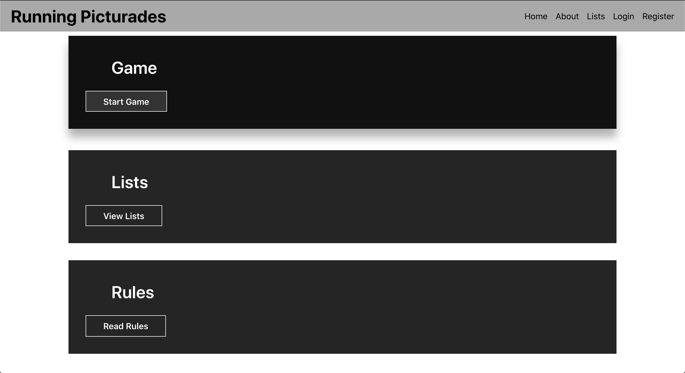
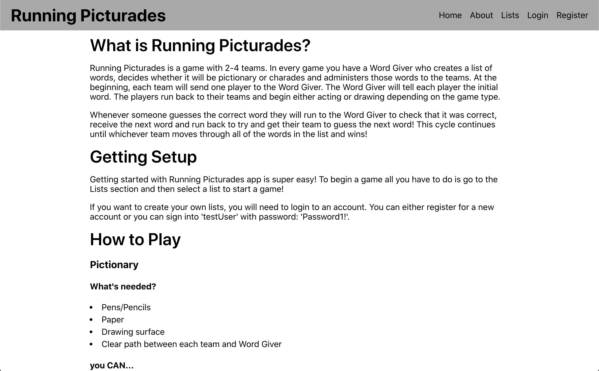
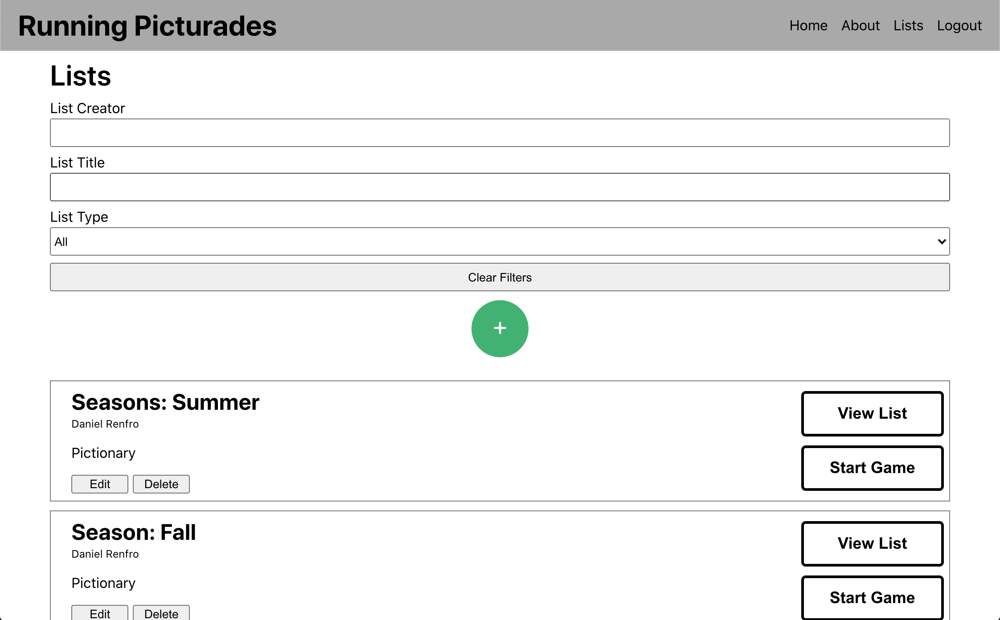
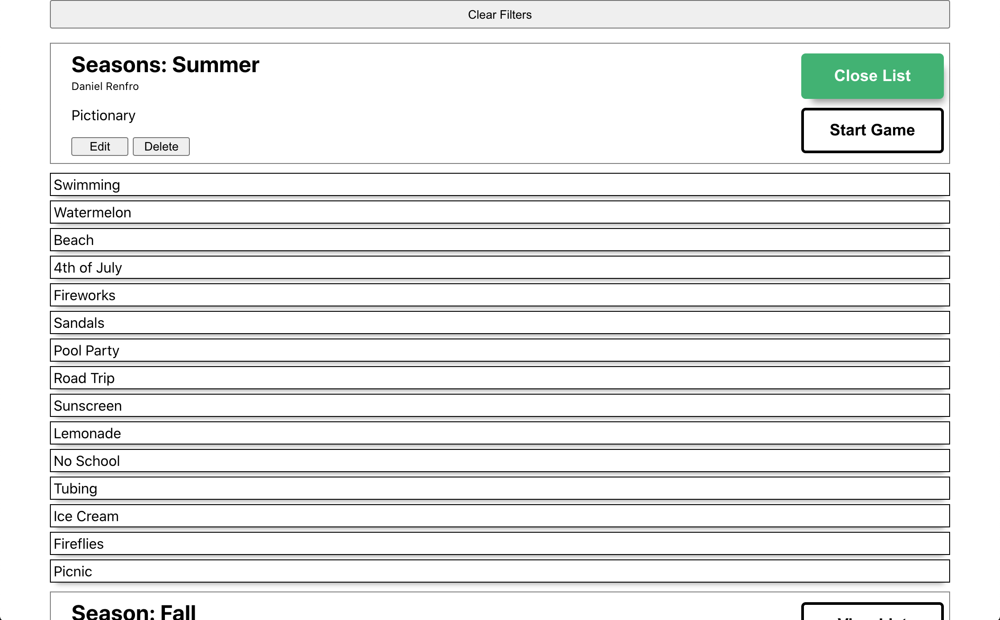
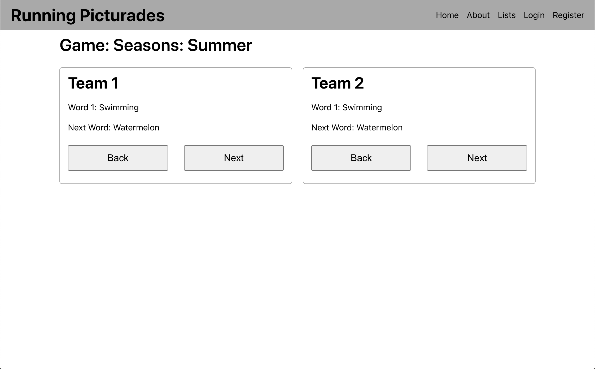
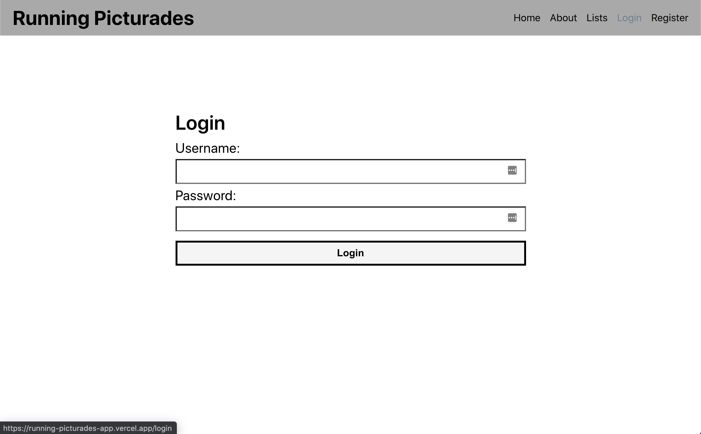
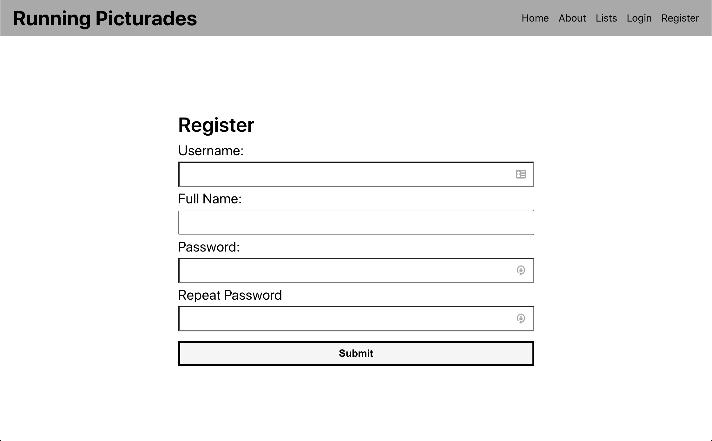
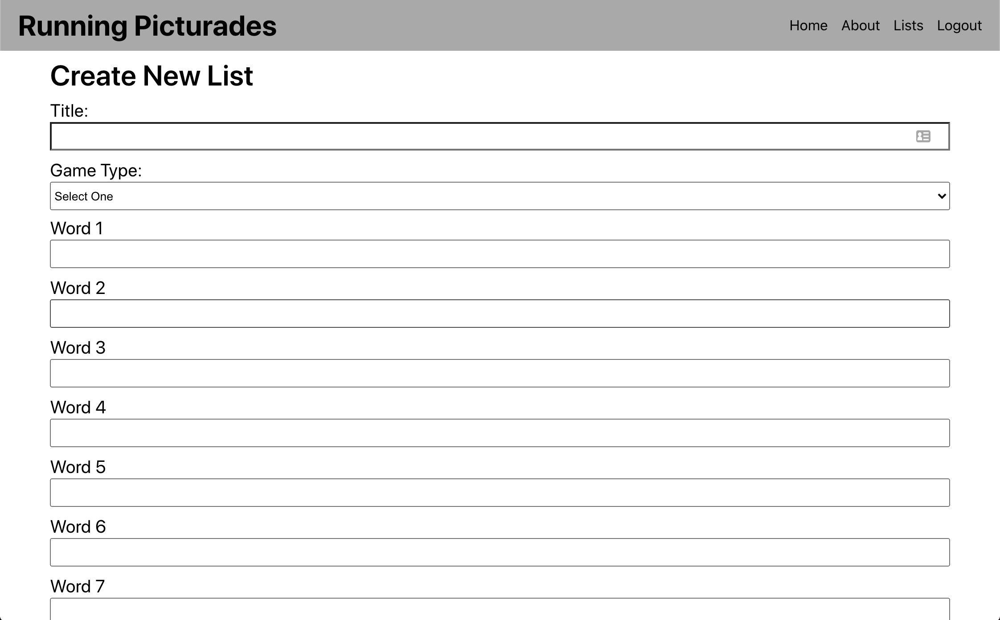
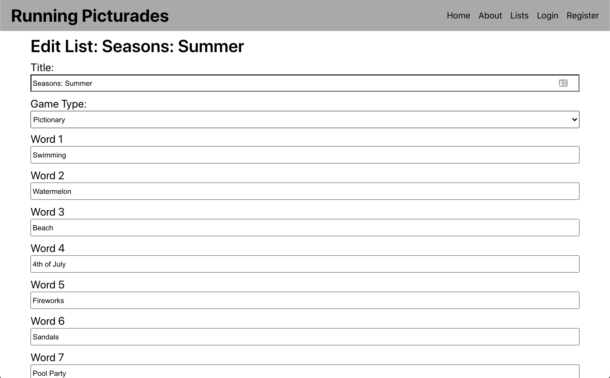

# Running Picturades App
[Running Picturades App](https://running-picturades-app.vercel.app/)

## Purpose of the App

Running Picturades is a game with 2 teams. In every game you have a Word Giver who creates a list of words, decides whether it will be pictionary or charades and administers those words to the teams. At the beginning, each team will send one player to the Word Giver. The Word Giver will tell each player the initial word. The players run back to their teams and begin either acting or drawing depending on the game type.

Whenever someone guesses the correct word they will run to the Word Giver to check that it was correct, receive the next word and run back to try and get their team to guess the next word! This cycle continues until whichever team moves through all of the words in the list and wins!

The purpose of the Running Picturades App is to assist the person who is managing a game of running pictionary or charades. The user will be able to create, edit, delete and see all lists. The user will be able to start a game from a list and administer the words to each team from that view.

***

## Tour of the App

### Home Page

*** 

### About Page

***

### Lists Page

***

### Lists Page with Open List

***

### Game Page

***

### Login Page

***

### Registration Page

***

### Create List Page

***

### Edit List Page

***

## Technology Used

### Backend
* Node.js
* PostgreSQL
* Express

### Frontend
* React
* Javascript
* HTML
* CSS